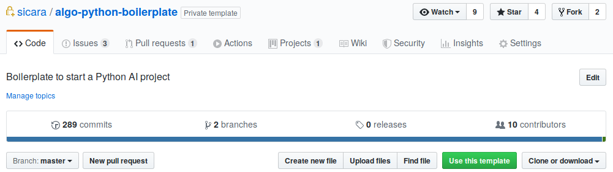

# Boilerplate for ML Projects with Sicara's stack

This repository is a boilerplate for Machine Learning Project at Sicara.

Main features are:
- python 3.6 or higher
- testing (pytest) and linting (pylint, pydocstyle)
- [CircleCI](https://circleci.com/) integration
- a standard code architecture

It also provides ML tools:

- [Chani](https://github.com/sicara/Chani): a tool to visualize image annotations e.g., bounding box with labels.
- [Pipeline](https://github.com/sicara/pipeline): a tool to easily build ML pipelines.
- [Polyaxon](https://docs.polyaxon.com): a platform for reproducing and managing the whole life cycle of ML applications.
- [Ibad](https://github.com/sicara/ibad): an easy-to-use library for computer vision.

## Requirements

- [You need an up-and-ready Polyaxon platform](docs/polyaxon-kubernetes-requirement.md)

## How to Create a ML Project

To create a new project, just click "Use this template" and follow the classic Github repo creation.

For more information, refer to Github documentation on [creating a repository from a template](https://help.github.com/en/articles/creating-a-repository-from-a-template)

## How to use the Boilerplate (for each dev in the project)

- [Setup CircleCI](docs/circle-ci.md)
- [Setup local environment](docs/local-env-setup.md)
- To configure your ML pipelines, see [the Pipeline documentation](https://github.com/sicara/pipeline)
- [Configure Access to Muaddib](docs/access_muaddib.md)
- [Synchronize your S3 data on Muaddib](docs/sync-data-s3.md)
- [How to use Polyaxon on Sicara's clusters](docs/polyaxon.md)

## Troubleshooting
- [How to use RTX2080 GPUs with Tensorflow](docs/rtx2080-tensorflow.md)

## Versions

Two versions of the Boilerplate are available:
- v1: Tensorflow 1.13 compatible
- v2: Tensorflow 2.0 compatible
