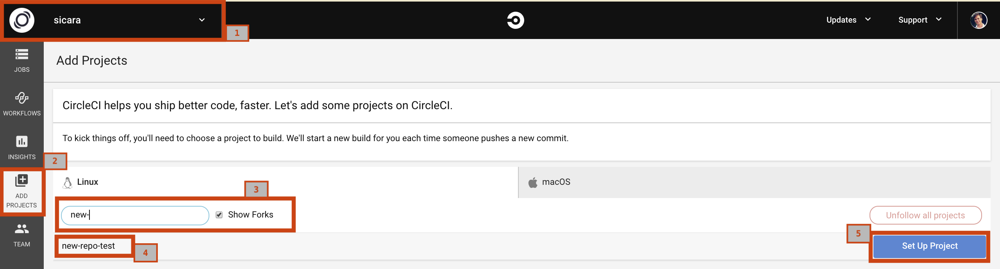
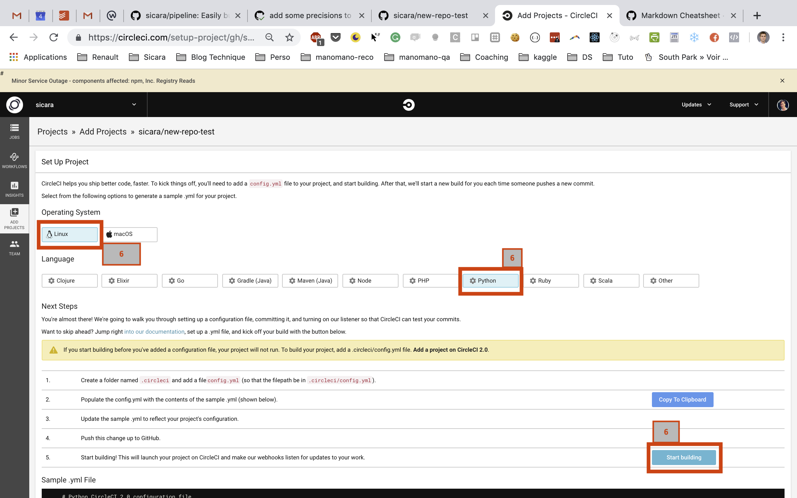
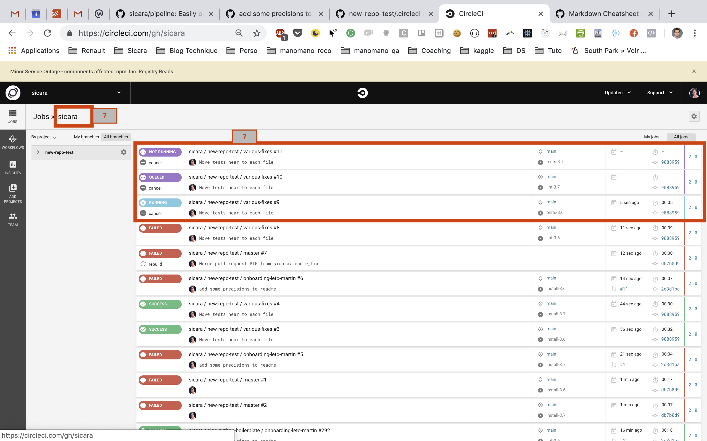
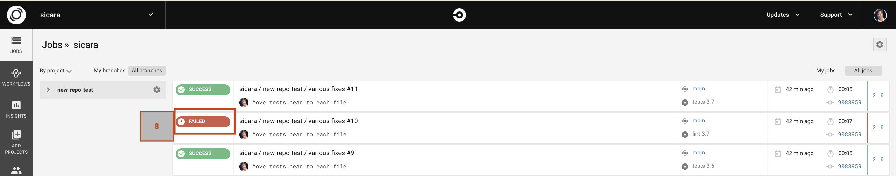
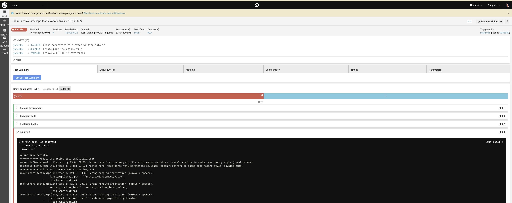

# Setup CircleCI

Add your project in the standard continuous integration tool [CircleCI](https://circleci.com/):

 0. Login with your account linked to Sicara
 1. Select `sicara` in the `switch organisation tab
 2. Click on `ADD PROJECTS`
 3. Search for your repository
 4. Check your repository is here
 5. Click on `Set Up Project`
    
 6. Set the Operating system to `Linux`, the language to `Python` and click on `Start building`
    
 7. Click on `Sicara` next to `Jobs >>` and check your building is going well
    
 8. If your project fail to build, click on `FAILED` and look at errors in the console logs.
 If the error is related to right access, check the next section.
    

    
    

# Add SSH Key to CircleCI to access Sicara private repositories

If building project requires to pull libraries from Sicara **private** github repositories,
you need to associate the SSH **user** key of Sicara, `msicara` in CircleCI.

0. Make sure that the Sicara team has access to the repository.
For this, go to your github repository, in "Settings" > "Collaborators & Teams"
1. [Login on Github](https://github.com/login) with the Sicara Machine User account `msicara`. Ask the Leto-Team for the password (you need to logout first if you were connected with an other account on Github).
2. [Login on Circle CI](https://circleci.com/vcs-authorize/) thanks to the Github Sicara Machine User account (you need to logout first if you were connected with an other account on CircleCI)
3. Select `sicara` in the `switch organisation tab`
4. Click on `Add Project` on the left tab
5. Find your project in the list
6. If it is not followed, click on the `Follow Project` button
7. Click on `workflows` on the left tab
8. Find your project on the list and click on the small gray wheel
9. Click on `Checkout SSH keys` on the left pane
10. Click on `Authorize with Github`
11. Click on `create and add msicara user key`

